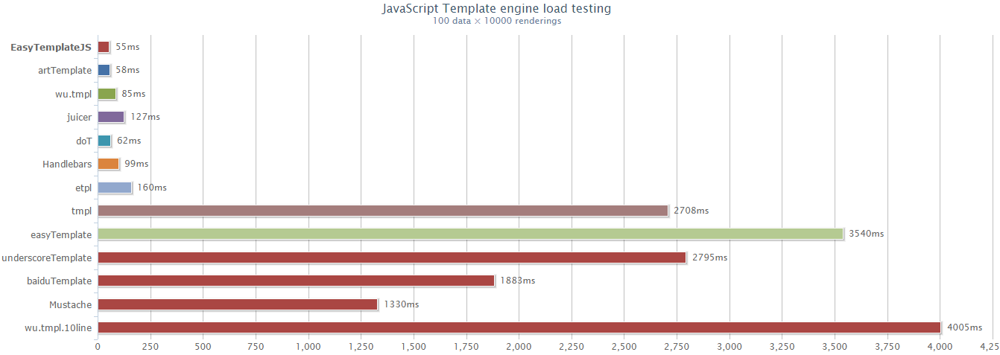

# EasyTemplateJS Template Engine User Guide

**EasyTemplateJS(EasyTemplate JavaScript) is an ultra-high performance, compact, full-featured JavaScript template engine. And provides enhanced support for Node.js and Express frameworks.**

JavaScript template engine as the data and interface separation of the most important part. Using JavaScript template functions to avoid the inconvenience and low maintenance of splicing `HTML` strings in JavaScript, embedding JavaScript scripts in` HTML` as opposed to using `JSP` and` ASP` Technical programming. EasyTemplate provides an ultra-high-performance rendering engine that uses template technology in JavaScript to simplify operations and enhance program design flexibility.

The latest version: `3.0.0-RELEASE`


## Feature 

- Ultra-high performance, pre-static compilation, small, pure

- Flexible customization

- Escape output expressions are supported

- Support out output

- Support embedded JavaScript (`<etj-script>...</etj-script>`) and CSS(`<etj-script>...</etj-script>`)

- Module support:`CommonJS`, `AMD`, `CMD`, `Node.js`

- Node.js [Express Web Framework support](doc/express_en.md)

- npm, Bower support


## Performance test comparison

From the rendering performance, **EasyTemplate** and artTemplate are using pre-static compilation principle, can be said to have close to the performance limit, is the highest performance of the template engine. Some poor engine may not only affect the customer experience, but also cause the browser to crash or abnormal termination, Baidu engine performance is poor, the implementation of the browser rendering a huge impact. 




## Use

### 1. Download

- Download install
	
	```HTML
	<script type="text/javascript" src="easy.templatejs.min.js"></script>
	```

- Bower install

	```BASH
	bower install easytemplatejs --save
	```
	
	```HTML
	<script src="bower_components/easytemplate/dist/easy.templatejs.min.js" type="text/javascript" charset="utf-8"></script>
	```
	
- Npm install

	```BASH
	npm install easytemplatejs
	```
	
	```JS
	var Et = require('easytemplatejs');
	```


### 2. TemplateJS Template expression

TemplateJS supports three types of template expressions, which do not allow nesting or crossover:

1. **The script expression**

  `%{ JavaScript Script }%`: The implementation of arbitrary JavaScript code (JSP `<%%>` the same small script), JS script `<`,`>` and other special symbols can also be used instead of the corresponding character entities.
  
2. **The output expression**

  `{=expression}`： Insert the variables to be output (the same as `<%= expression%>` for JSP).

3. **The escape output expression**
 
  `{-expression}`： Usage is the same as `{expression}`, and special characters are automatically escaped as character entities when outputting data.
  

-  **Why do I choose `%{}%`, `{=}` as a closed tag?**
 
EasyTemplateJS did not select the commonly used `<%%>` or `${}` as the default closing tag of the template engine, because in the JSP, ASP and other dynamic pages, `<%%>`, `${}` itself is a dynamic special mark, When a page defines a template tag, it affects JSP parsing, resulting in compilation errors. So EasyTemplate chose `%{}%` `{=}` that will not conflict with other languages as much as possible.

However, if you prefer to use `<%%>` or `${}`, the EasyTemplate template tag is external to allow customization, you can modify it to `<%%>` to match your old template code.(`Refer to 5. Template Custom`)


### 3. Examples

EasyTemplateJS exposes an object named **`Et`** to complete the template operation.

```JS
// 1. Execute the template directly
var result = Et.template(tmplText, data);

// 2. Template compilation
var compiled = Et.template(tmplText);
// Compiled and executed
var res2 = compiled(data);
var res3 = compiled(data2);
var res4 = compiled(data3);
```

- Basic Template Example

	```JS
	// Basic demo
	var compiled = Et.template("hello: {=name }, {-name}");
	var res = compiled({
		name: 'MoMo'
	});
	console.info(res); // hello: MoMo, MoMo
	
	// Special label, test escape
	var res2 = compiled({
		name: '<MoMo>'
	}); 
	console.info(res2); // hello: <MoMo>, &lt;MoMo&gt;
	
	
	// Test escape (Special label)
	var compiled2 = Et.template("<u>{- value }</u>");
	var res3 = compiled2({
		value: '<script>'
	});
	console.info(res3); // <u>&lt;script&gt;</u>


	var res4 = Et.template("%{ out('Hello: '+name); }%", {
		name: "JACK"
	});
	console.info(res4); //Hello: JACK
	```


- HTML Template Example

	```HTML
	<!-- Ordinary template -->
	<script id="tmpl" type="text/tmpl">
		%{ for(var i in people){ }%
			<li>{=i} = {= people[i] }</li>
		%{ } }%
	</script>

	<!-- Use HTML to define template content, if there are special content such as <,>, you can use the corresponding character entity instead -->
	<script id="tmpl2" type="text/tmpl">
		%{ for(var i=0; i &lt; people.length; i++){ }%
			<li>{=i} = {= people[i] }</li>
		%{ } }%
	</script>

	<!-- Use the out output -->
	<script id="tmpl3" type="text/tmpl">
		%{ 
			for(var i=0; i < people.length; i++){ 
				out( "<li>"+i+ " = "+people[i]+ "</li> "); 
			} 
		}% 
	</script>
	
	
	<script type="text/javascript">
		// With jQuery
	    $(function(){
			<!-- Use the template  -->
			// temp demo
			var tmpl = $("#tmpl").html();
			var res5 = Et.template(tmpl, {
				people: ['MoMo', 'Joy', 'Ray']
			});
			console.info(res5);
		
			// temp2 demo
			var tmpl2 = $("#tmpl2").html(); 
			var res6 = Et.template(tmpl2, {
				people: ['MoMo', 'Joy', 'Ray']
			});
			console.info(res6);
		
			// temp3 demo
			var tmpl3 = $("#tmpl3").html(); 
			var res7 = Et.template(tmpl3, {
				people: ['MoMo', 'Joy', 'Ray']
			});
			console.info(res7);
		});
	</script>
	```

	Output:
	
	```HTML
	<li>0 = MoMo</li>      
	<li>1 = Joy</li>    
	<li>2 = Ray</li>          
	```

### 4. Use out output information

You can also use the `out` function to output information in your JavaScript code so that you do not have to break your code block, which is sometimes easier and clearer than using `{=name}` '.

```HTML
<!--  out -->
<script id="tmpl3" type="text/tmpl">
	%{ 
		for(var i=0; i < people.length; i++){ 
			// out function
			out( "<li>"+i+ " = "+people[i]+ "</li> "); 
		} 
	}% 
</script>
```

```JS
var res4 = Et.template("%{ out('Hello: '+name); }%", {
		name: "JACK"
	});
console.info(res4); //Hello: JACK
```


### 5. Customization template expression closed tag

Because certain template definition and execution blocks have special meanings in some dynamic pages (`JSP`,` ASP`), the use of template symbols on some pages can cause errors. EasyTemplate allows you to change the template settings and use other symbols to embed the code.

> **Why do I choose `%{}%`, `{=}` as a closed tag?**
>
> EasyTemplateJS did not select the commonly used `<%%>` or `${}` as the default closing tag of the template engine, because in the JSP, ASP and other dynamic pages, `<%%>`, `${}` itself is a dynamic special mark, When a page defines a template tag, it affects JSP parsing, resulting in compilation errors. So EasyTemplate chose `%{}%` `{=}` that will not conflict with other languages as much as possible.
>
> However, if you prefer to use `<%%>` or `${}`, the EasyTemplate template tag is external to allow customization, you can modify it to `<%%>` to match your old template code.

**Note:** If you absolutely modify the closing label of a template expression, you need to be careful to check that your definition logic is reasonable.

`Et.tmplSettings` Default configuration:

```JS
Et.tmplSettings={
	// Script expression %{ JS script }%
	scriptBegin:"%{",
	scriptEnd:"}%",
	// Output expression {name}
	outBegin:"{=",
	outEnd:"}",
	// Escape output expression {-name}
	escapeOutBegin:"{-",
	escapeOutEnd:"}"
}
```

Redefine the example:

```JS
var userSettings=
{
	// Script expression  <% JS script %>
	scriptBegin:"<%",
	scriptEnd:"%>",
	// Output expression <%=name %>
	outBegin:"<%=",
	outEnd:"%>",
	// Escape output expression <%-name %>
	escapeOutBegin:"<%-",
	escapeOutEnd:"%>"
}
```

```JS
// Global modifications
Et.tmplSettings=userSettings;

// test
console.info(
	Et.template(
		"hello: <%= name %>, <%- name %>",  // templateText
		{name: '<MoMo>'} // data
	)
);			
```

```JS
// Local modification test
console.info(
	Et.template(
		"hello: <%= name %>, <%- name %>",  // templateText
		{name: '<MoMo>'}, 					// data
		userSettings 						//settings
	)
);	
```


### 6. How do I use global or external objects?

Because EasyTemplateJS is a JS cross-platform template engine that can be used in both the browser environment and the desktop environment, the global object is not managed directly.

Can be used as needed directly incoming:

```JS
var res = Et.template(tmpl, {
	'people': ['MoMo', 'Joy', 'Ray'],
	'console': window.console,
	'window': window,
	'alert': alert 
});
```

### 7. Embedded JavaScript and CSS

To enhance the functional experience of using templates in Express and other server-side Web application frameworks, EasyTemplateJS pioneered the provision of script scripts and style style sheet support for templates.

- **Enable scripting and CSS support**

	The default script and style support is turned off and can be turned on manually as needed.

	```javascript
	Et.enableScript = true; // enable <etj-script>
	Et.enableStyle = true; // enable <etj-style>
	```

- **Script code support**

	Place the JavaScript code between the `<etj-script>` ... `</etj-script>` tags. **The statement must end with `;`.**
	
- **CSS code support**
		
	Place the CSS code between the `<etj-style>` ... `</etj-style>` tags.

- **Example**

	```HTML
	<etj-script>
		function test(){
			var num=100
			console.info('test execute...')
		}
		test()
		var r2=document.getElementById('res2');
		r2.innerHTML='<h3>etj-script</h3>'
		r2.className="blue";
		// use data 
		var t='{=title}';
		console.info(t);
	</etj-script>
	
	
	<etj-style>
		#res3{
			color:Red;
			/*use data*/
			font-size:{=textSize}px;
		}
		.blue{color:blue; }
	</etj-style>
	
	%{ 
		console.info('Global'); 
		<!--alert('Global');-->
		for(var i in people){ }%
		<li>{i} = 
			{ people[i] } 
		</li>
	%{ } }%
	```


## API

`Et` Exposing a limited number of APIs:

- Core function

	```JS
	/**
	 * The template engine compiles the core functions
	 * @param {String} tmplText Template code
	 * @param {Object} data Template data; optional
	 * @param {Et.tmplSettings} settings Engine dynamic control parameters; optional
	 * @return {String|function} If the data is not empty, return String rendering results; otherwise, return a compiled function rendering function
	 */
	Et.template(tmplText, data, settings);
	```

- Template closure label custom (`5. template expression closed tag custom`)

	```JS
	Et.tmplSettings ={...}
	```
  
- Special characters in a string are escaped as character entities and returned

	```JS
	/**
	 * Special characters in a string are escaped as character entities and returned
	 * @param {String} text 
	 * @return {String} 
	 */
	Et.escape(text);
	```  

- Escape the reverse operation function, the string of characters into the characters, and return

	```JS
	/**
	 * Escape the reverse operation function, the string of characters into the characters, and return
	 * @param {text} text
	 * @return {String} 
	 */
	Et.unescape(text);
	``` 
  
- Traversing a collection or object
	
	```JS
	/**
	 * Traversing a collection or object.
	 * @param {Object} obj The collection or object to be traversed
	 * @param {function} iterator Iteration functions, including the value, index, set the three parameters of the object
	 * @param {Object} context Binding an iterator to the context executes it, which can be used to pass some other elements to iteraotr
	 */
	 Et.each(list, iterator, [context]);
	```

- Restores the object referenced by `Et` as the original object and returns the` Et` object.

	```JS
	/**
	 * Eliminate conflicts
	 * @return {Et} Et object
	 */
	Et.noConflict();
	```
   

## Module support

- AMD Example
	```JS
	require.config({
		paths: {
			Et: "js/easy.templatejs.min-2.1.0"
		}
	});

	require(["Et"], function(Et) {
		// Basic demo
		var compiled = Et.template("hello: { name }, {-name}");
		var res = compiled({
			name: 'MoMo'
		});
		var res2 = compiled({
			name: '<MoMo>'
		}); // Special label, test escape
		
		console.info(res);
		console.info(res2);
	});
	```
	
## Use EasyTemplateJS in Express 

- Manual integration

	[Express documentation](express_en.md)

- Express application generator tool based on EasyTemplateJS

	[Express-quicker](https://github.com/ushelp/Express-quicker)


## END
### [The official home page](http://www.easyproject.cn/easytemplate/en/index.jsp 'The official home page')

[Comments](http://www.easyproject.cn/easytemplate/en/index.jsp#donation 'Comments')

If you have more comments, suggestions or ideas, please contact me.


### [官方主页](http://www.easyproject.cn/easytemplate/zh-cn/index.jsp '官方主页')

[留言评论](http://www.easyproject.cn/easytemplate/zh-cn/index.jsp#donation '留言评论')

如果您有更好意见，建议或想法，请联系我。


Email：<inthinkcolor@gmail.com>

[http://www.easyproject.cn](http://www.easyproject.cn "EasyProject Home")


We believe that the contribution of each bit by bit, will be driven to produce more and better free and open source products a big step.

**Thank you donation to support the server running and encourage more community members.**

[](https://www.paypal.me/easyproject/10 "Make payments with PayPal - it's fast, free and secure!")